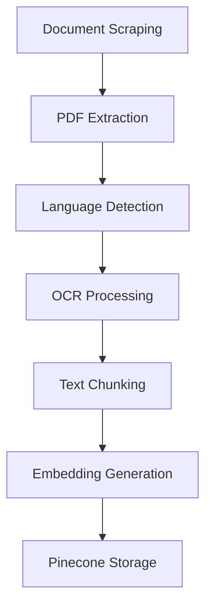

# Sri Lankan Tea Industry AI Assistant

[](LICENSE)
[](https://www.python.org/)
[](https://conda.io/)

Industry-grade AI solution for processing and analyzing tea industry documents with multi-language support and semantic search capabilities.

## Project Structure
```bash
tea-ai-assistant/
├── config/                 # Configuration files
│   ├── logging.yaml       # Logging configuration
│   └── processing.yaml    # Document processing parameters
├── data/                   # Sample data and test documents
├── docs/                   # Documentation and specifications
├── src/                    # Source code
│   ├── scrapers/          # Web scraping components
│   ├── pdf_processor/     # PDF extraction and processing
│   ├── vector_db/         # Pinecone integration
│   └── utils/             # Helper functions and utilities
├── environment.yml         # Conda environment specification
├── LICENSE
└── README.md
```

## Conda Environment Setup

1. Create and activate conda environment:
```bash
conda env create -f environment.yml
conda activate scraper_env
```

2. Verify Tesseract installation:
```bash
tesseract --version  # Should show version 5.3.4 with Sinhala/Tamil support
```

3. Configure environment variables:
```bash
cp .env.example .env
# Update .env with your Pinecone credentials and Tesseract path
```

## Processing Pipeline




## Configuration Management
- Update `config/processing.yaml` for:
  - Chunking parameters
  - OCR confidence thresholds
  - Language-specific processing rules
- Environment variables for sensitive credentials
- YAML configurations for processing parameters


**Best Practices:**
- Monitor embedding dimensions vs index configuration
- Track OCR success rates by language
- Log chunking efficiency metrics
- Implement circuit breakers for API calls


## Version Compatibility
| Component       | Version  | Notes                          |
|-----------------|----------|--------------------------------|
| PyTorch         | 2.5.1    | CPU-only optimized            |
| SentenceBERT    | 3.4.0    | Multi-lingual variant          |
| Pinecone Client | 5.0.1    | Optimized batch operations